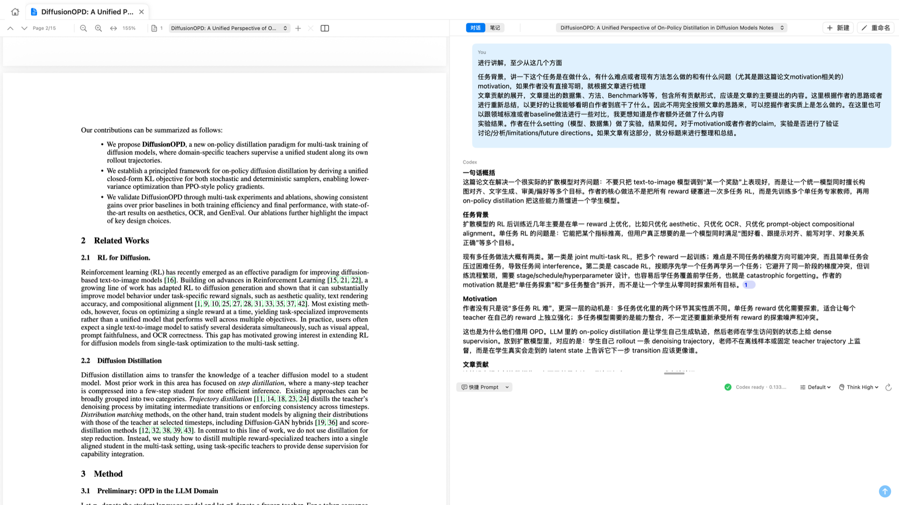
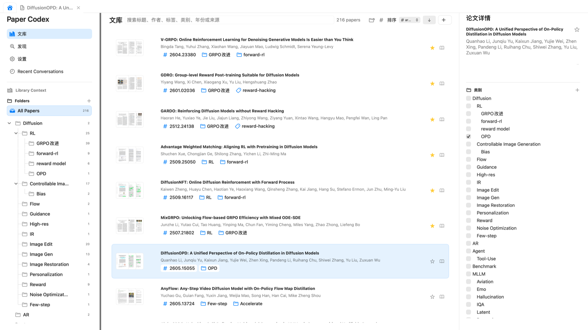
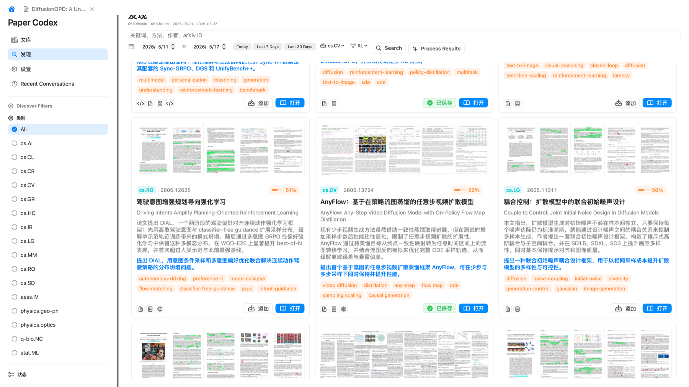
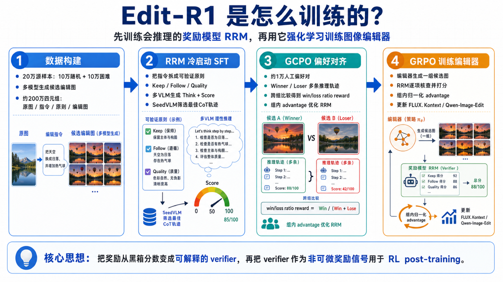
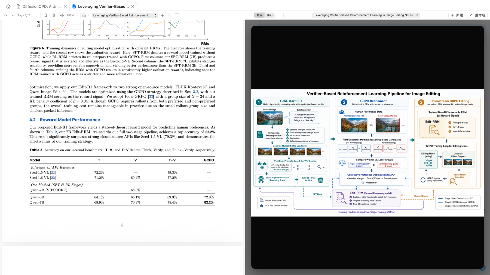
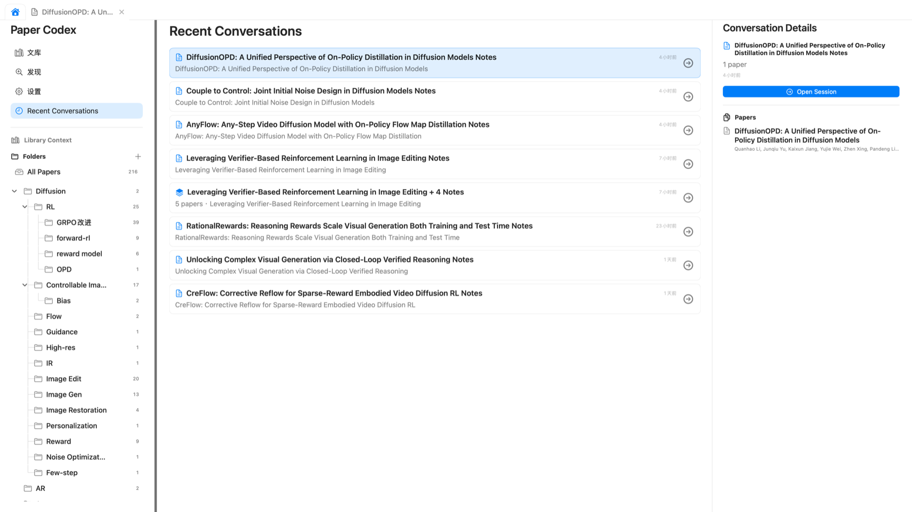
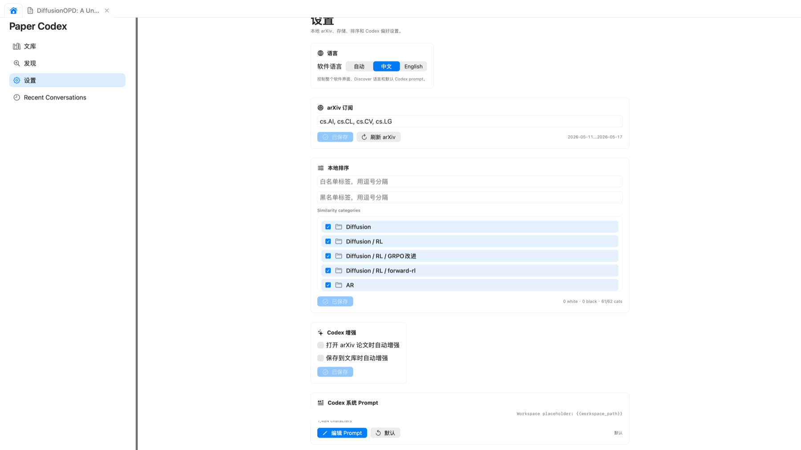
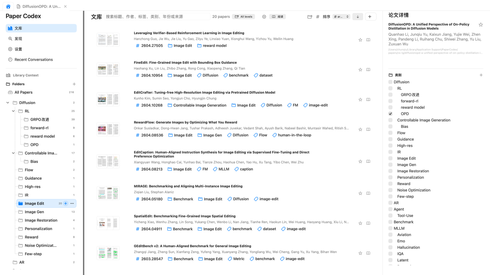
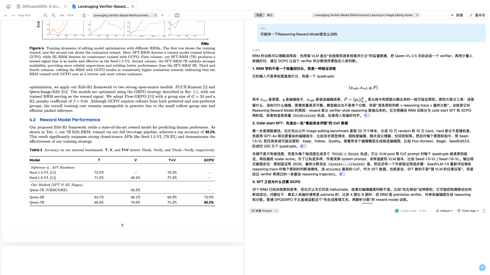

# Paper Codex Showcase

<p align="center">
  <a href="showcase.zh-CN.md">简体中文</a> · <strong>English</strong>
</p>

This page gives a visual tour of the current Paper Codex interface. The screenshots were captured from the native macOS app with a real local research library, so they show the intended day-to-day product flow rather than placeholder mockups.

## Intro Video

The Remotion source lives in [docs/video](video). The rendered video is a detailed product walkthrough using real Paper Codex screenshots, generated-image output, in-app preview captures, and animated focus moves that zoom into the relevant controls:

[docs/assets/videos/paper-codex-intro.mp4](assets/videos/paper-codex-intro.mp4)

## 1. Reader And Codex Chat



The reader is the main working surface. Paper tabs stay in the top chrome, the PDF toolbar keeps page and zoom controls close to the document, and the right panel keeps conversation and notes in the same context.

What this screen demonstrates:

- PDFKit-backed reading with page navigation and zoom controls.
- Browser-like paper tabs for keeping active papers open.
- A Codex conversation that can cite back to source regions in the PDF.
- Compact session controls for switching between chat and notes.

## 2. Local Paper Library



The library view is built for repeated paper triage. The left side exposes folder structure, the center list stays dense enough for scanning, and the right detail panel lets you inspect metadata, tags, and folder membership without leaving the list.

What this screen demonstrates:

- Nested folders with visible paper counts.
- Search over title, authors, tags, categories, year, and source.
- PDF thumbnails for quick visual recognition.
- Star, read, tag, and folder actions in one local workspace.

## 3. arXiv Discover



Discover turns arXiv browsing into a local-first pipeline. It combines date/category filters, cached thumbnails, local similarity scores, generated Chinese summaries, and save/open actions.

What this screen demonstrates:

- Date-range and category-based arXiv search.
- Local cache for paper cards, PDF thumbnails, and metadata.
- Codex-enriched Chinese titles, summaries, contribution notes, and tags.
- Save-to-library and open-in-reader actions from the result grid.

## 4. Generated Image Output



Generated images can become part of the research session. Paper Codex keeps the asset in the session workspace and can bring it back into the reading flow for in-app preview.



The video uses this real preview state to show generated images being inspected inside Paper Codex rather than opened as external files.

## 5. Sessions And Settings



Recent conversations make prior work resumable instead of one-off. Each entry points back to the relevant paper context and session details.



Settings expose the local knobs that make the tool fit a real workflow: language, arXiv subscriptions, local ranking sources, Codex enrichment, embedding service, and reusable quick prompts.

## 6. Focused Demo Captures



The focused video pass uses folder-filtered library and reader/chat captures so the camera can move to the exact UI region being discussed.



## Capture Notes

The screenshots are intentionally real product captures. If the UI changes, refresh these files after rebuilding the app:

```bash
scripts/build-app-bundle.sh
open "$HOME/Applications/PaperCodex.app"
```

Then replace the images in:

```text
docs/assets/screenshots/
├── library.png
├── discover.png
├── reader-chat.png
├── generated-output.png
├── in-app-image-preview.png
├── library-folder-filter.png
├── session-generated-chat.png
├── recent-conversations.png
└── settings.png
```
